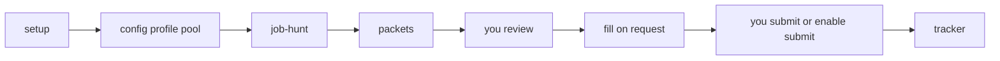

# Quarry

[](LICENSE)

Cursor-agent job hunt: discover roles, stage application packets, fill forms on request. **Submit stays off until you turn it on.**

Not a web app. Not a SaaS. Clone the repo, open it in Cursor, and the agent works on your machine.

Works for any occupation you configure in setup — nursing, trades, product, design, research, operations, software, and the rest.

**New to Cursor?** Start with [docs/getting-started.md](docs/getting-started.md).

## Table of contents

1. [It learns boards after the first fill](#it-learns-boards-after-the-first-fill)
2. [Agent vs you](#agent-vs-you)
3. [Who it is for](#who-it-is-for)
4. [Requirements](#requirements)
5. [Model and cost](#model-and-cost)
6. [How it works](#how-it-works)
7. [Install](#install)
8. [First run (setup)](#first-run-setup)
9. [Adapting to your field](#adapting-to-your-field)
10. [Daily workflow](#daily-workflow)
11. [How to prompt Quarry](#how-to-prompt-quarry)
12. [Skills](#skills)
13. [Repo layout](#repo-layout)
14. [Config reference](#config-reference)
15. [Packets](#packets)
16. [Application fill](#application-fill)
17. [Browser sessions](#browser-sessions)
18. [Privacy](#privacy)
19. [FAQ](#faq)
20. [Disclaimer](#disclaimer)
21. [Credits](#credits)

## It learns boards after the first fill

Quarry ships notes for common ATS boards: Greenhouse, Lever, Ashby, Simplify, Workable, Jobvite, Teamtailor, Work at a Startup, and related playbooks under `.cursor/skills/apply-autofill/`.

The first time the agent fills a board (or hits a new quirk), it writes that into `lessons.md` and the matching `boards/*.md`. The next application on that board uses those notes. You should not have to re-teach react-select, file uploads, or EEO widgets.

The completeness check still runs every time. If the agent missed a quirk, say:

```text
remember this for the next fill
```

## Agent vs you

| Agent | You |
| --- | --- |
| Setup interview | Install Cursor, answer setup |
| Discovery and scoring | Review staged packets |
| Resume and cover drafts | Keep experience truthful |
| Optional form fill | Click Submit unless you enabled apply |
| Tracker updates | Sign in / solve captcha when asked |
| Append fill lessons | Steer with chat prompts |

Default: **review**. Fill does not submit.

## Who it is for

People who use Cursor and want an agent to run a structured job search. Not software-only. Career change, licensed trades, PM, design, research, nursing, engineering — setup writes the occupation.

## Requirements

- [Cursor](https://cursor.com)
- Node.js LTS (resume/cover PDFs)
- Python 3 (save/restore job-board logins)
- Git optional (ZIP download works)

No job-board API keys. Browser tools in Cursor handle discovery and fill.

## Model and cost

**Composer 2.5** at **regular** speed can run setup, hunt, tailor, cover, and fill. A hunt still takes many agent turns (each packet is several steps).

On Cursor’s current pricing, Composer 2.5 tokens are cheap because Cursor subsidizes them, so a **$20/month** plan can run this a lot. Cursor’s prices can change. Bigger or slower models are optional, not required.

## How it works



1. Setup writes config, profile, pool, tailor policy, and discovery logins.
2. Job-hunt discovers and stages packets (enabled sources only).
3. You review `pipeline/packets/` and `pipeline/tracker.md`.
4. You ask to fill a packet. Completeness check runs.
5. You submit — or you turn submit on for a packet/session.
6. Tracker marks applied / skipped / interview.

## Install

```bash
git clone https://github.com/jackjusko/quarry.git
cd quarry
npm install
```

Open the folder in Cursor (**File → Open Folder**).

Never used Cursor? See [docs/getting-started.md](docs/getting-started.md) (ZIP download, Node, Python, Composer 2.5).

## First run (setup)

In Cursor chat:

```text
run setup
```

The agent asks, one section at a time:

1. Occupation and hunt config (titles, location, comp, scoring)
2. Which sites to search — and login + cookie save for boards that need it
3. Candidate profile (EEO/address/DOB optional)
4. Experience pool (resume paste or PDF extract, then role pass)
5. Resume tailor policy (core roles, weave, sections)

You can hand-edit the markdown files instead. Setup replaces template markers (`YOUR_NAME`, `SETUP_INCOMPLETE`, fictional Example Org stub).

## Adapting to your field

Setup writes occupation, titles, scoring weights, tailor policy, and discovery sources. Job-hunt will not search LinkedIn unless you enabled it and signed in. It will not look for “Software Engineer” unless you said so.

To change target mid-search:

```text
Re-run setup for the hunt config only.
```

or

```text
Change location allow-list to … and continue.
```

## Daily workflow

```text
run job hunt
```

Review packets. Then:

```text
fill the packet for <company>
```

That **does not** submit. You click Submit in the browser, then:

```text
mark <company> applied
```

If a board logged you out:

```text
restore my job board logins
```

## How to prompt Quarry

The engine is the skills in `.cursor/skills/`. You steer them in chat. There is no full-auto loop that discovers, fills, and submits everything unattended. Captcha, login, and leftovers need you.

### Hunt

```text
run job hunt
run job hunt, N=10, focus: remote registered nurse in Texas
stage these URLs: https://…
skip LinkedIn this run, public ATS only
```

### Materials

```text
tailor the resume for packet …
rewrite the cover letter, shorter
```

### Fill (review — default)

```text
fill the packet for <company>
fill the next staged packet. Do not submit.
```

### Fill and submit (opt-in)

```text
fill the packet for <company> and submit if the completeness check passes
for this session, submit after verification. Stop on leftovers, captcha, or login.
submit this form
turn submit off
```

Leftovers, captcha, and login walls always stop the run, even when submit is on. Completeness check always runs before submit.

### Config and memory

```text
change location allow-list to …
add Indeed as a discovery source and save the login
remember this for the next fill
```

## Skills

| Skill | Use |
| --- | --- |
| `setup` | First-run interview; install deps |
| `job-hunt` | Discover and stage packets |
| `tailor-resume` | Role-targeted resume JSON + PDF |
| `cover-letter` | Cover letter + PDF |
| `apply-autofill` | Fill ATS forms (ask explicitly) |
| `interview-prep` | Stories / drills from pool + config |
| `follow-up` | Follow-up drafts |
| `write-well` | Prose rules for letters and docs |

## Repo layout

```text
experience/          pool.md, tailor-policy.md
pipeline/
  config.md          hunt filters, sources, submit mode
  candidate-profile.md
  tracker.md
  browser-auth.md
  packets/           staged applications
  playbooks/         e.g. LinkedIn discovery
schemas/             resume JSON schema
scripts/             validate, render, extract, browser-auth
.cursor/skills/      agent skills + ATS boards + lessons
docs/getting-started.md
```

## Config reference

| File | Controls |
| --- | --- |
| `pipeline/config.md` | Occupation, titles, location, comp, scoring, enabled sources, **submit mode** (`review` default / `when-verified`) |
| `pipeline/candidate-profile.md` | Name, contact, auth, optional EEO/address |
| `experience/pool.md` | Employers, dates, outcomes |
| `experience/tailor-policy.md` | Core vs optional roles, weave, must-include sections |
| `pipeline/browser-auth.md` | Which boards are logged in / saved |

## Packets

Naming: `YYYYMMDD-<company-slug>-<role-slug>`

Each packet should include: `meta.json`, `job-description.md`, `resume.json` / `resume.pdf`, `cover-letter.txt` / `cover-letter.pdf`, `form-answers.md`, `handoff.md`.

Statuses: `discovered` · `staged` · `filled` · `applied` · `skipped` · `interview`

## Application fill

- Cursor embedded browser + board playbooks + `lessons.md` (standing memory)
- PDF upload via DataTransfer chunks (see apply-autofill skill)
- Pre-report verification gate (scroll, read-back, uploads) before “filled”
- **Submit off by default** — see [How to prompt Quarry](#how-to-prompt-quarry)

v1 fill playbooks focus on common US ATS hosts (Greenhouse, Lever, Ashby, and the boards under `boards/`). Other sites may still get a staged packet; fill quality varies until lessons accumulate.

## Browser sessions

```bash
python3 scripts/browser-auth.py save linkedin
python3 scripts/browser-auth.py restore all
python3 scripts/browser-auth.py list
```

Cookie JSON under `pipeline/browser-auth/` is gitignored. After a Cursor cookie wipe, restore, then reload the tab.

LinkedIn: use email + password. Google sign-in often hangs in the Cursor browser.

## Privacy

Filled profile, pool, packets, and auth JSON stay on your machine. Do not push a public fork of a live hunt.

Gitignored: `pipeline/browser-auth/*.json`, `pipeline/.setup-complete`, packet contents (see `.gitignore`), `output/*.pdf`.

## FAQ

**Is this a website?** No. Local Cursor project.

**Does it auto-apply?** No, unless you say so. Default is fill and stop.

**Can it run the whole hunt unattended?** No. You will sign in, solve captchas, and check leftovers. Prompt one step at a time.

**Which model?** Composer 2.5 regular is enough. See [Model and cost](#model-and-cost).

**Setup not triggering?** Say `run setup`. Check for `YOUR_NAME` in the profile or missing `pipeline/.setup-complete`.

**Agent said filled but fields are blank?** Paste: `This is not complete. Re-run the verification gate, list empty required fields, and fill them.`

More corrections: [docs/getting-started.md](docs/getting-started.md#if-something-is-wrong).

## Disclaimer

Respect employer and ATS terms of use. You are responsible for the accuracy of claims on your materials and for any submit you enable. The agent fills; you own the application.

## Credits

The **write-well** skill uses George Orwell’s essay [*Politics and the English Language*](https://www.orwellfoundation.com/the-orwell-foundation/orwell/essays-and-other-works/politics-and-the-english-language/) (Horizon, 1946). Credit to Orwell for that part of the prose guidance. The rest of Quarry is separate work.
